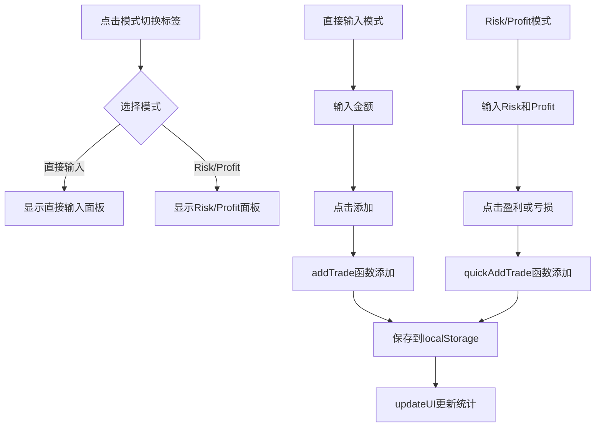

# 新增 Risk/Profit 快速添加交易模式

## 功能概述

将现有的"数据输入"卡片改造为**双模式切换**：
- **直接输入模式**：现有的输入净盈亏金额方式
- **Risk/Profit 模式**：输入 risk 和 profit，点击盈亏按钮添加

两种模式通过**模式切换标签**进行切换，同一时间只显示一种模式。

## UI 设计

### 组件结构
```html
<!-- 数据输入卡片（改造后） -->
<div class="card">
    <div class="card-title">数据输入</div>

    <!-- 模式切换标签 -->
    <div class="mode-tabs">
        <button class="mode-tab active" data-mode="direct" onclick="switchInputMode('direct')">
            直接输入
        </button>
        <button class="mode-tab" data-mode="risk-profit" onclick="switchInputMode('risk-profit')">
            Risk/Profit
        </button>
    </div>

    <!-- 直接输入模式内容 -->
    <div id="directModePanel" class="mode-panel">
        <div class="input-group">
            <input type="number" id="profitInput" placeholder="输入净盈亏金额" 
                   onkeypress="handleKeyPress(event)">
            <button class="btn btn-primary" onclick="addTrade()">添加</button>
        </div>
        <p style="font-size: 0.8rem; color: var(--text-secondary); margin-top: 10px;">
            按 Enter 快速添加，支持正负数字
        </p>
    </div>

    <!-- Risk/Profit 模式内容 -->
    <div id="riskProfitModePanel" class="mode-panel" style="display: none;">
        <div class="input-group">
            <input type="number" id="riskInput" placeholder="Risk（亏损）">
            <input type="number" id="profitInputRP" placeholder="Profit（盈利）">
        </div>
        <div class="quick-add-buttons">
            <button class="btn btn-profit" onclick="quickAddTrade('profit')">
                📈 盈利
            </button>
            <button class="btn btn-loss" onclick="quickAddTrade('loss')">
                📉 亏损
            </button>
        </div>
        <p style="font-size: 0.8rem; color: var(--text-secondary); margin-top: 10px;">
            输入 Risk 和 Profit，点击上方按钮添加交易记录
        </p>
    </div>
</div>
```

### 样式设计

#### 模式切换标签
```css
.mode-tabs {
    display: flex;
    gap: 8px;
    margin-bottom: 16px;
    border-bottom: 1px solid rgba(255, 255, 255, 0.1);
    padding-bottom: 12px;
}

.mode-tab {
    padding: 8px 16px;
    border: none;
    background: transparent;
    color: var(--text-secondary);
    cursor: pointer;
    border-radius: 6px;
    font-size: 0.9rem;
    transition: all 0.2s ease;
}

.mode-tab:hover {
    background: rgba(255, 255, 255, 0.05);
}

.mode-tab.active {
    background: var(--accent-color);
    color: var(--bg-primary);
    font-weight: 500;
}
```

#### Risk/Profit 模式按钮
```css
.btn-profit {
    flex: 1;
    background: var(--profit-color);
    color: white;
}

.btn-profit:hover {
    background: #00b85c;
}

.btn-loss {
    flex: 1;
    background: var(--loss-color);
    color: white;
}

.btn-loss:hover {
    background: #e63946;
}

.quick-add-buttons {
    display: flex;
    gap: 10px;
    margin-top: 12px;
}
```

### 视觉预览

**直接输入模式：**
```
┌─────────────────────────────────┐
│  数据输入                        │
│  [直接输入] [Risk/Profit]        │ ← 模式切换标签
│                                 │
│  [ 输入净盈亏金额          ] [添加] │
│  按 Enter 快速添加               │
└─────────────────────────────────┘
```

**Risk/Profit 模式：**
```
┌─────────────────────────────────┐
│  数据输入                        │
│  [直接输入] [Risk/Profit]        │ ← 模式切换标签
│                                 │
│  [ Risk（亏损）            ]     │
│  [ Profit（盈利）          ]     │
│  [📈 盈利]  [📉 亏损]            │
│  输入 Risk 和 Profit，点击添加    │
└─────────────────────────────────┘
```

## 功能逻辑

### 模式切换函数
```javascript
let currentInputMode = 'direct'; // 'direct' 或 'risk-profit'

function switchInputMode(mode) {
    currentInputMode = mode;
    
    // 更新标签样式
    document.querySelectorAll('.mode-tab').forEach(tab => {
        tab.classList.remove('active');
        if (tab.dataset.mode === mode) {
            tab.classList.add('active');
        }
    });
    
    // 切换面板显示
    document.getElementById('directModePanel').style.display = 
        mode === 'direct' ? 'block' : 'none';
    document.getElementById('riskProfitModePanel').style.display = 
        mode === 'risk-profit' ? 'block' : 'none';
}
```

### Risk/Profit 快速添加函数
```javascript
function quickAddTrade(type) {
    const risk = parseFloat(document.getElementById('riskInput').value);
    const profit = parseFloat(document.getElementById('profitInputRP').value);

    if (isNaN(risk) || isNaN(profit)) {
        alert('请输入有效的 Risk 和 Profit 值');
        return;
    }

    const value = type === 'profit' ? profit : -risk;
    const data = getData();
    data.trades.push(value);
    saveData(data);
    
    // 不清除输入框，方便继续添加
    updateUI();
}
```

## 实现步骤

1. **HTML 修改**：
   - 在现有"数据输入"卡片中添加模式切换标签
   - 将现有输入框包裹在 `directModePanel` 中
   - 添加 `riskProfitModePanel` 面板

2. **CSS 添加**：
   - `.mode-tabs` - 切换标签容器
   - `.mode-tab` / `.mode-tab.active` - 标签样式
   - `.mode-panel` - 模式面板
   - `.quick-add-buttons` - 盈亏按钮容器
   - `.btn-profit` / `.btn-loss` - 盈亏按钮样式

3. **JavaScript 添加**：
   - `currentInputMode` 全局变量
   - `switchInputMode(mode)` 切换函数
   - `quickAddTrade(type)` Risk/Profit 添加函数

## 数据流程图



## 兼容性考虑

- localStorage 数据结构不变
- 现有 `addTrade()` 函数保持不变
- 模式切换通过 CSS display 属性实现，用户切换模式后数据状态保持
- 默认打开"直接输入"模式